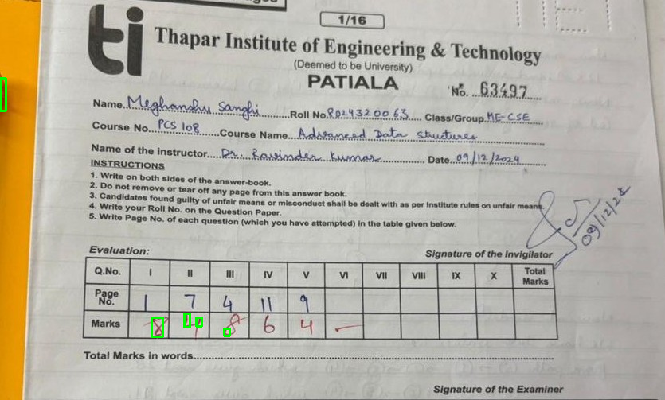

# 🧮 SCANCULATOR – INTELLIGENT EXAM SHEET DIGIT RECOGNITION

Scanculator is an **AI-powered computer vision system** designed to automatically **extract and recognize handwritten digits from scanned exam sheets**.  
The project focuses on reducing manual effort in exam evaluation by enabling **accurate and automated digit detection and recognition** from real-world scanned documents.

---

## 🔍 Problem Statement
Manual evaluation of exam answer sheets is time-consuming, error-prone, and difficult to scale.  
Handwritten marks—especially evaluator-written digits in **red ink**—are challenging to detect due to noise, background text, and handwriting variations.

Scanculator addresses these challenges using **computer vision and deep learning techniques**.

---

## 🚀 Key Features
- Automated handwritten digit extraction from scanned exam sheets  
- OpenCV-based digit detection and ROI extraction  
- CNN-based digit recognition for accurate prediction  
- Red-ink digit detection to isolate evaluator-written marks  
- End-to-end automated processing pipeline  

---

## 🧠 Methodology Overview

### 1️⃣ Image Preprocessing
- Noise reduction and grayscale conversion  
- Thresholding and morphological operations  
- Color-based filtering for red-ink digit isolation  

### 2️⃣ Digit Detection
- Contour detection to locate handwritten regions  
- Bounding box extraction to isolate individual digits  
- ROI normalization for model input  

### 3️⃣ Digit Recognition
- Convolutional Neural Network (CNN) trained on handwritten digits  
- Model predicts numerical values from extracted ROIs  

### 4️⃣ End-to-End Integration
- Python-based pipeline for automated processing  
- Final output provides recognized digits for evaluation  

---

## 📊 Results
- Reliable detection of handwritten digits from scanned exam sheets  
- Accurate recognition of evaluator-written numerical marks  
- Robust performance across variations in handwriting and scan quality  

---

## 🖼️ Project Demonstration

  

*The above figure demonstrates successful detection and localization of handwritten digits from a scanned exam sheet using bounding boxes.*

